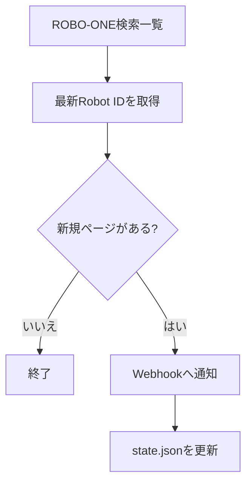

# ROBO-ONE 新規ロボット通知

[](https://github.com/pukutai3/watch_robo_oneID/actions/workflows/watch.yml)

ROBO-ONE公式サイトを定期確認し、新しいロボットガレージが公開されたらDiscordへ通知するウォッチャーです。GitHub Actionsだけで運用でき、専用サーバーは不要です。

| 項目 | 内容 |
| --- | --- |
| 監視対象 | [ROBO-ONE ロボット検索](https://www.robo-one.com/rankings/search/) |
| 通知先 | Discord Webhook、または任意のWebhook |
| 実行方法 | GitHub Actions（10分おきの設定）またはローカル実行 |
| 状態管理 | 最後に通知したRobot IDを `state.json` に保存 |

> [!IMPORTANT]
> GitHub Actionsの定期実行は遅延・欠落する場合があります。正確な10分間隔が必要な用途では、常駐環境または実行保証のある外部スケジューラを使用してください。

## 動作の流れ



1. 検索一覧の最終ページから、現在の最大Robot IDを取得します。
2. `state.json` の `last_seen_id + 1` から最大IDまでを確認します。
3. 実在する新規ページを1件ずつ通知します。
4. 通知成功ごとに `state.json` を更新します。

IDに欠番があっても、その先まで確認します。検索一覧の構造を解析できない場合は、未通知のまま成功扱いにせずエラー終了します。

## GitHub Actionsで運用する

### 1. Discord Webhookを用意する

通知先チャンネルの設定からWebhook URLを作成します。URLをリポジトリ内のファイルへ直接書かないでください。

### 2. GitHub Secretを登録する

リポジトリの次の画面を開きます。

`Settings > Secrets and variables > Actions > New repository secret`

| Name | Value |
| --- | --- |
| `DISCORD_WEBHOOK_URL` | Discordで作成したWebhook URL |

Discord以外へJSONを送る場合は、代わりに `NOTIFY_WEBHOOK_URL` を登録できます。どちらか一方が必要です。

### 3. 初回実行を確認する

1. リポジトリの **Actions** を開きます。
2. **Watch ROBO-ONE garage** を選びます。
3. **Run workflow** を実行します。
4. `Run watcher` が成功することを確認します。

GitHub Actionsでは `REQUIRE_NOTIFICATION=true` のため、通知先が未設定ならエラーになります。以降は定期実行され、`state.json` に変更がある場合だけ自動でcommit・pushします。

## ローカルで確認する

推奨環境は、GitHub Actionsと同じPython 3.12です。外部パッケージは使用しません。

```bash
python watch_robo_one.py
```

特定のRobot IDだけを確認する場合:

```bash
python watch_robo_one.py --probe 1966
```

`--probe` はページが存在すれば終了コード `0`、未作成なら `1` を返します。ローカルの通知設定は `.env.example` を `.env.local` にコピーして記入します。

> [!CAUTION]
> `.env.local` とWebhook URLはcommitしないでください。Webhook URLが外部へ漏れた場合は、Discord側で削除して作り直してください。

## 設定

| 環境変数 | 既定値 | 説明 |
| --- | --- | --- |
| `DISCORD_WEBHOOK_URL` | 未設定 | Discordへ通知します。設定時はこちらを優先します。 |
| `NOTIFY_WEBHOOK_URL` | 未設定 | Discord以外のWebhookへJSONを送信します。 |
| `ROBO_ONE_START_ID` | `state.json` の値 | 監視開始位置を一時的に上書きします。 |
| `REQUEST_TIMEOUT` | `20` | HTTPリクエストのタイムアウト秒数です。 |
| `REQUIRE_NOTIFICATION` | `false` | `true` の場合、通知先が未設定ならエラー終了します。 |

Discord以外のWebhookには次のJSONを送信します。

```json
{
  "robot_id": 1930,
  "name": "sample",
  "team_name": "sample team",
  "country": "日本",
  "comment": "sample comment",
  "url": "https://www.robo-one.com/rankings/view/1930",
  "image_url": "https://www.robo-one.com/upload/robots/example.jpg"
}
```

## トラブルシューティング

| 症状 | 確認すること |
| --- | --- |
| Actionsは成功したが通知がない | 新規ロボットがなければ正常です。通知は新規ページ発見時だけ送信します。 |
| `no notification webhook is configured` | `DISCORD_WEBHOOK_URL` または `NOTIFY_WEBHOOK_URL` をGitHub Secretsへ登録します。 |
| 定刻に実行されない | GitHub Actionsの定期実行は遅延・欠落する場合があります。必要なら手動実行します。 |
| `No robot IDs found` | ROBO-ONE検索ページの構造が変わった可能性があります。パーサーの更新が必要です。 |
| 同じ通知が届く | 通知後に状態のcommit・pushが失敗していないか、Actionsログを確認します。 |

## テスト

```bash
python -m unittest -v
```

テストは外部通信を行わず、最新IDの抽出、欠番を含む走査、通知設定、通知後の状態保存を確認します。
